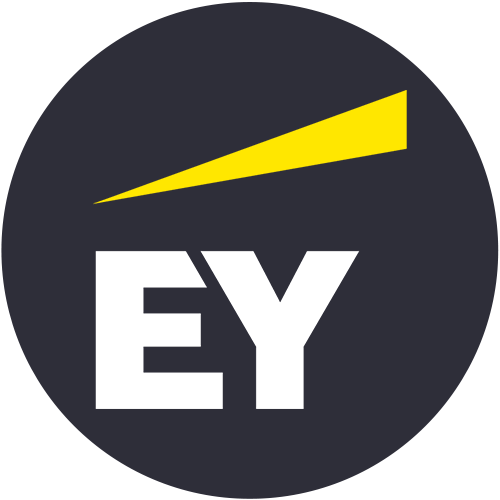

<!-- PROFILE HEADER -->

  

<h1 align="center">Samantha Chang</h1>

  Caltech CS + Applied Math Student • AI Intern @ Cedars-Sinai Medical Center • iOS Developer (50,000+ App Store Downloads)

  
  
  

---

## 💼 Experience

<table>
  <tr>
    <td align="center" width="25%">
       
      <strong>AI Intern</strong> 
      Cedars-Sinai Medical Center 
      <em>June 2025 – Present</em> 
      Built an LLM-powered pipeline to extract elements from clinical notes and integrated into real-life hospital systems.
    </td>
    <td align="center" width="25%">
       
      <strong>iOS Developer</strong> 
      Apple App Store 
      <em>2020 – Present</em> 
      Published 8 apps with 50K+ downloads. Designed and released full-stack Swift apps independently.
    </td>
    <td align="center" width="25%">
       
      <strong>AI Research Fellow</strong> 
      Caltech 
      <em>June 2025 – Present</em> 
      Co-author on 3 papers. Analyzed LLM-based persuasion using statistical methods on large datasets.
    </td>
    <td align="center" width="25%">
       
      <strong>Expedition Intern</strong> 
      Ernst & Young 
      <em>Mar 2025 – Jun 2025</em> 
      Completed bootcamps in finance and AI. Explored real-world use cases in market intelligence.
    </td>
  </tr>
</table>

---

## 🚀 Featured Projects

<table>
  <tr>
    <td align="center" width="33%">
       
      <strong>Cedars-Sinai Assistant</strong> 
      Daily habit app with reminders and streaks using SwiftUI. 
      <a href="https://apps.apple.com/app/id000000">App Store →</a>
    </td>
    <td align="center" width="33%">
       
      <strong>ScrollType</strong> 
      Minimalist puzzle game built with UIKit and custom animations. 
      <a href="https://apps.apple.com/app/id000000">App Store →</a>
    </td>
    <td align="center" width="33%">
       
      <strong>Epic Word Trip</strong> 
      OCR utility powered by VisionKit and Core ML for iOS. 
      <a href="https://github.com/samanthachang/SmartOCR">GitHub →</a>
    </td>
  </tr>

  <tr>
    <td align="center" width="33%">
       
      <strong>Youth Voter</strong> 
      Calendar app with Pomodoro-style productivity sessions. 
      <a href="https://apps.apple.com/app/id000000">App Store →</a>
    </td>
    <td align="center" width="33%">
       
      <strong>Placeholder</strong> 
      ARKit-based physics game for balance and spatial control. 
      <a href="https://github.com/samanthachang/ARBalance">GitHub →</a>
    </td>
    <td align="center" width="33%">
       
      <strong>Placeholder</strong> 
      LLM + RAG chat tool for summarizing clinical notes. 
      <a href="https://github.com/samanthachang/GPTNotes">GitHub →</a>
    </td>
  </tr>
</table>
