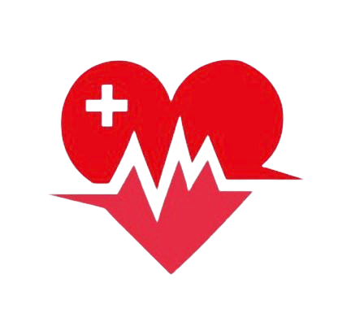
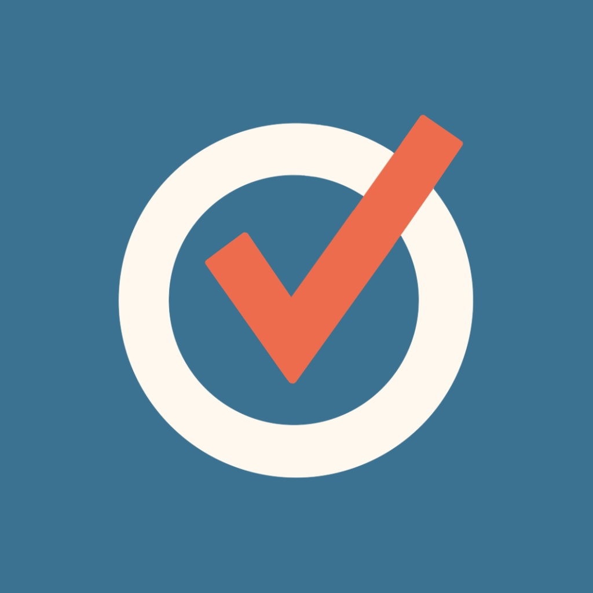
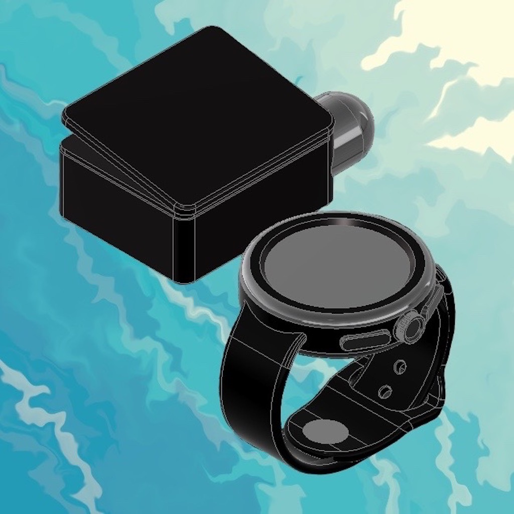
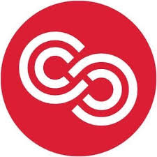
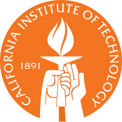

<!-- PROFILE HEADER -->
<h1 align="center">Samantha Chang</h1>

  Caltech CS + Applied Math Student • AI Intern @ Cedars-Sinai Medical Center • iOS Developer (50,000+ App Store Downloads)

  
  
  
  

## 🚀 Featured Projects

<table>
  <tr>
    <td align="center" width="33%">
       
      <strong>Physician Assistant for Cedars-Sinai</strong> 
      Transcribes and summarizes patient notes with an LLM. 
      <a href="https://github.com/samanthac02/Physician-Assistant">GitHub Repo</a>
    </td>
    <td align="center" width="33%">
       
      <strong>ScrollType</strong> 
      User-friendly texting app for Apple Watch users. 
      <a href="https://github.com/samanthac02/Scroll-Type">GitHub Repo</a>
    </td>
    <td align="center" width="33%">
       
      <strong>Epic Word Trip</strong> 
      Wordle-inspired game played by scanning license plates and signs on road trips. 🏆 Apple Swift Challenge Winner, 2022 
      <a href="https://github.com/samanthac02/Epic-Word-Trip-iOS-App">GitHub Repo</a>
    </td>
  </tr>
  <tr>
    <td align="center" width="33%">
       
      <strong>Youth Voter</strong> 
      Resource for encouraging teens to register to vote. 🏆 Congressional App Challenge 2nd place, 2021 
      <a href="https://github.com/samanthac02/Youth-Voter">GitHub Repo</a>
    </td>
    <td align="center" width="33%">
       
      <strong>Drowning Detection Assistant</strong> 
      Connects with drowning detection device via Bluetooth to report signs of drowning. 🏆 $7,500 grant recipient from Lemelson-MIT 
      <a href="https://github.com/samanthac02/Drowning-Detection">GitHub Repo</a>
    </td>
    <td align="center" width="33%">
       
      <strong>ScrollPhrase</strong> 
      Allows easy sending of pre-written messages on Apple Watch. 
      <a href="https://github.com/samanthac02/Scroll-Phrase">GitHub Repo</a>
    </td>
  </tr>
</table>

---

## 💼 Work Experience

<table>
  <tr>
    <td align="center" width="25%">
       
      <strong>AI Intern</strong> 
      Cedars-Sinai  
      <em>June 2025 – Present</em> 
      Built an LLM-powered pipeline to extract elements from clinical notes and integrated into real-life hospital systems.
    </td>
    <td align="center" width="25%">
       
      <strong>iOS Developer</strong> 
      Apple App Store 
      <em>2020 – Present</em> 
      Published 8 apps with 50K+ downloads. Designed and released full-stack Swift apps independently.
    </td>
    <td align="center" width="25%">
       
      <strong>AI Research Fellow</strong> 
      Caltech 
      <em>June 2025 – Present</em> 
      Co-author on 3 papers. Analyzed LLM-based persuasion using statistical methods on large datasets.
    </td>
    <td align="center" width="25%">
       
      <strong>Expedition Intern</strong> 
      Ernst & Young 
      <em>Mar 2025 – Jun 2025</em> 
      Completed bootcamps in finance and AI. Explored real-world use cases in market intelligence.
    </td>
  </tr>
</table>
